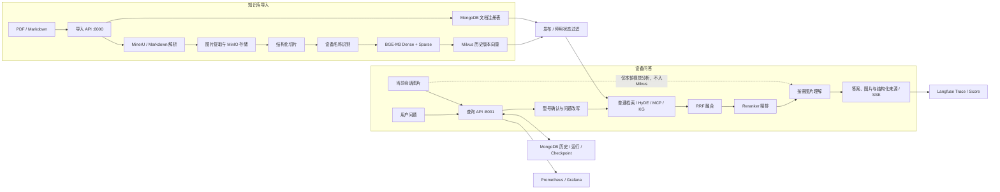

<div align="center">

# Equipment RAG Agent

面向设备手册、SOP 与运维知识的多模态 RAG Agent

基于 **Vue 3、FastAPI、LangGraph、MinerU、BGE-M3、Milvus、Reranker、MinIO、MongoDB 与 Langfuse**，提供文档导入、混合检索、型号确认、图片理解、多轮问答、流式输出、运行恢复和质量评测。


</div>

---

## 阅读导航

第一次使用时，建议按以下顺序阅读：

1. [先了解项目能做什么](#项目能做什么)
2. [准备环境并完成最小配置](#5-分钟快速开始)
3. [打开导入、治理和聊天页面](#服务地址)
4. [需要调整效果时查看配置地图](#配置地图)
5. [遇到问题时查看排障清单](#常见问题)

更深入的专题文档：

| 文档 | 适合什么时候看 |
|---|---|
| [后端模块边界](docs/backend-architecture.md) | 需要理解服务入口、业务模块和基础设施依赖方向时 |
| [配置与密钥指南](docs/configuration.md) | 不清楚 API Key、连接地址或密码从哪里获取时 |
| [飞书审批连接器](docs/feishu-workflow.md) | 从未解决问答自动发起飞书“设备问题处理”审批 |
| [可观测、评测与调优指南](docs/observability.md) | 需要分析 Trace、指标或调整 RAG 参数时 |
| [运行恢复说明](docs/durable-runtime.md) | 需要理解任务状态、Checkpoint 和失败重试时 |
| [安全与多租户说明](docs/security.md) | 准备部署到服务器或开放给其他用户时 |
| [评测使用说明](evals/README.md) | 准备黄金问题集和自动回归时 |
| [贡献指南](CONTRIBUTING.md) | 准备修改代码或提交 Pull Request 时 |

---

## 项目能做什么

项目不是单一的“PDF 问答 Demo”，而是由两条可独立运行的 Agent 工作流组成：

- **知识库导入 Agent**：解析 PDF/Markdown，提取图片和上下文，识别设备名称，生成 Dense/Sparse 向量并写入 Milvus。
- **设备问答 Agent**：确认设备型号，并行执行普通检索、HyDE、联网搜索和图谱预留节点，经过 RRF 与 Reranker 后生成带图片的回答。

### 已实现能力

| 能力 | 说明 |
|---|---|
| PDF / Markdown 导入 | PDF 使用独立 MinerU 服务解析；Markdown 可直接导入 |
| 多模态图片链路 | 图片保存到 MinIO，可异步生成说明，并按问题返回相关手册图片 |
| 会话图片附件 | 聊天页可上传 JPG/PNG/WebP 辅助本轮分析；附件不进入 Milvus、文档切片或长期知识库 |
| Vue 业务页面 | Vue 3 + TypeScript 聊天、快速导入、知识治理三页面，支持拖拽上传、版本操作、历史消息、反馈和 API Key 设置 |
| 知识版本治理 | 文档注册表、草稿审核、按适用范围发布、并行软件/固件版本、回滚、停用、启用和操作审计 |
| 可核验回答 | 助手消息返回文档名、业务版本、适用软件/固件、章节、PDF物理页码和证据摘要，关键结论要求引用资料编号 |
| 型号确认 | 明确型号优先精确识别；模糊名称按阈值自动确认或要求用户澄清 |
| 混合检索 | BGE-M3 Dense + Sparse、HyDE、RRF、BGE/Qwen Reranker |
| 多轮问答 | MongoDB 保存严格按时间排列的用户/助手消息、设备名、图片和 Trace ID |
| 流式回答 | FastAPI + SSE 返回节点进度、增量文本和最终结果 |
| 可恢复运行 | MongoDB 运行注册表与 LangGraph Checkpoint 支持失败重试 |
| 可观测与调优 | Langfuse Trace/Score、Prometheus 指标、Grafana Dashboard、离线评测 |
| 安全隔离 | API Key、角色、租户级会话/向量/对象存储隔离 |

### 当前边界

- Neo4j 节点已接入流程，但实际图谱查询仍是预留实现。
- 百炼 WebSearch MCP 是可选能力；关闭或调用失败时会降级到本地知识库。
- MinerU 只在导入 PDF 时必需，导入 Markdown 和普通问答不依赖它。
- 聊天页图片是临时会话附件，清空会话时同步删除；要长期检索的资料应从“知识库导入”页面上传。
- 本项目用于知识检索和辅助判断，不能替代设备安全规范、锁机挂牌流程或专业工程师确认。

---

## 系统架构



导入节点：

```text
node_entry
  ├─ PDF → node_pdf_to_md
  └─ MD  ─────────────────┐
                          ↓
node_md_img → node_document_split → node_item_name_recognition
            → node_bge_embedding → node_import_milvus → END
```

问答节点：

```text
node_item_name_confirm
  → node_multi_search
      ├─ node_search_embedding
      ├─ node_search_embedding_hyde
      ├─ node_web_search_mcp
      └─ node_query_kg（预留）
  → node_join → node_rrf → node_rerank
  → node_image_reasoning → node_answer_output → END
```

---

## 5 分钟快速开始

### 1. 环境要求

| 环境 | 要求 |
|---|---|
| 操作系统 | 推荐 Windows 10/11；Linux 和 WSL2 可使用 Docker Compose |
| Docker | Docker Desktop 或 Docker Engine，支持 Compose v2 |
| 主项目 Python | 仅本地开发需要，版本 `>=3.14,<3.15` |
| uv | 仅本地开发或安装 MinerU 时需要 |
| Node.js | 仅修改前端时需要，推荐 Node.js 22 LTS |
| 内存 | 建议至少 16 GB；模型首次加载时占用会明显增加 |
| GPU | 可选；默认配置使用 CPU，首次验证不要求 NVIDIA GPU |

### 2. 克隆并创建配置

Windows PowerShell：

```powershell
git clone https://github.com/Markhhyu/equipment-rag-agent.git
cd equipment-rag-agent
Copy-Item .env.example .env
notepad .env
```

Linux / macOS：

```bash
git clone https://github.com/Markhhyu/equipment-rag-agent.git
cd equipment-rag-agent
cp .env.example .env
```

`.env` 已被 Git 忽略。不要使用 `git add -f .env`，也不要把密钥粘贴到 Issue、日志或截图中。

### 3. 填写最小模型配置

首次启动至少确认以下配置：

```env
OPENAI_BASE_URL=https://api.openai.com/v1
OPENAI_API_KEY=替换为真实密钥
LLM_DEFAULT_MODEL=gpt-4.1-mini
VL_MODEL=gpt-4.1-mini
```

这里使用的是 **OpenAI-compatible API**。使用阿里云百炼或其他兼容服务时，应同时替换 Base URL、API Key 和模型 ID；不要在 Key 前添加 `Bearer `。

如果暂时不使用联网搜索、Langfuse 或 Neo4j，保持以下配置为空或关闭即可：

```env
MCP_DASHSCOPE_BASE_URL=
LANGFUSE_TRACING_ENABLED=false
NEO4J_URI=
```

### 4. 一键启动

Windows 推荐使用：

```powershell
.\start-all.ps1
```

如果执行策略阻止 `.ps1`，可以运行：

```powershell
.\start-all.cmd
```

脚本会依次完成：

1. 校验 Docker、Compose 文件和模型配置；
2. 启动或修复本地 Langfuse 配置，不删除已有数据卷；
3. 启动 MongoDB、MinIO、etcd 和 Milvus；
4. 检测并按需启动宿主机 MinerU；
5. 构建并启动导入 API、查询 API；
6. 启动 Prometheus、Grafana 和 Attu；
7. 等待健康检查并打印所有访问地址。

首次启动需要下载容器镜像、Python 依赖、BGE-M3 和 Reranker 模型，耗时取决于网络和磁盘速度。

### 5. 查看状态与停止服务

```powershell
docker compose --profile observability ps
docker compose logs --tail 200 import-api query-api
```

安全暂停全部服务：

```powershell
.\stop-all.ps1
```

删除容器和网络、但保留命名卷及业务数据：

```powershell
.\stop-all.ps1 -RemoveContainers
```

> 不要把 `docker compose down -v` 当作普通排障命令。`-v` 会删除 MongoDB、Milvus、MinIO、Langfuse 和仪表盘数据。

---

## 服务地址

默认只绑定 `127.0.0.1`，不会直接暴露到局域网。

| 服务 | 默认地址 | 用途 |
|---|---|---|
| 导入页面 | <http://127.0.0.1:8000/import.html> | 上传 PDF/Markdown 并查看导入进度 |
| 知识库治理 | <http://127.0.0.1:8000/knowledge.html> | 文档版本、发布、回滚、停用和操作审计 |
| 聊天页面 | <http://127.0.0.1:8001/chat.html> | 多轮问答、结构化来源、图片展示和反馈 |
| 问答运营看板 | <http://127.0.0.1:8001/analytics.html> | 每日问答、技术成功率、解决结果和待关注问题 |
| 导入 API 文档 | <http://127.0.0.1:8000/docs> | 导入接口 Swagger |
| 查询 API 文档 | <http://127.0.0.1:8001/docs> | 问答接口 Swagger |
| MinIO 控制台 | <http://127.0.0.1:9001> | 查看原始文件和图片对象 |
| Langfuse | <http://127.0.0.1:3000> | 单次 Trace、Token、Score 和反馈 |
| Grafana | <http://127.0.0.1:3001> | 延迟、错误率和长期趋势 |
| Attu | <http://127.0.0.1:3002> | 查看 Milvus Collection 与数据 |
| Prometheus | <http://127.0.0.1:9090> | 查询原始指标 |
| MinerU API | <http://127.0.0.1:8002/docs> | PDF 解析服务；安装后才可访问 |

端口冲突时修改 `.env` 中的 `*_PORT`，不需要修改源码。

---

## 启动方式

### Windows 一键脚本参数

| 参数 | 适用场景 |
|---|---|
| `-SkipBuild` | 代码和依赖没有变化，只想快速恢复容器 |
| `-CoreOnly` | 内存有限，不启动 Langfuse、Prometheus/Grafana 和 Attu |
| `-NoLangfuse` | 只跳过 Langfuse |
| `-NoObservability` | 只跳过 Prometheus 和 Grafana |
| `-NoAttu` | 只跳过 Milvus 管理页面 |
| `-NoMineru` | 不解析 PDF，或 MinerU 由其他方式运行 |
| `-TimeoutSeconds 1200` | 首次下载镜像/模型较慢，延长单服务等待时间 |
| `-MineruPort 8002` | MinerU 使用了非默认端口 |

示例：

```powershell
# 日常快速恢复
.\start-all.ps1 -SkipBuild

# 低内存环境，只运行核心 RAG 服务并跳过 MinerU
.\start-all.ps1 -CoreOnly -NoMineru

# 保留仪表盘，只跳过 Langfuse 和 Attu
.\start-all.ps1 -NoLangfuse -NoAttu
```

### 手工启动 Docker 核心服务

```powershell
docker compose config --quiet
docker compose up -d --build
docker compose ps
```

该方式默认启动两个 API、MongoDB、MinIO、etcd 和 Milvus，不启动独立 MinerU、Langfuse、Attu；Prometheus/Grafana 需要显式启用 profile：

```powershell
docker compose --profile observability up -d
```

---

## 配置地图

`.env.example` 是完整、带中文注释的配置手册。初次使用不需要理解全部变量，可以按功能分组逐步配置。

### 配置优先级

1. 当前进程环境变量；
2. 仓库根目录 `.env`；
3. `compose.yaml` 或代码中的安全默认值。

修改 `.env` 后需要重新创建相关容器：

```powershell
docker compose up -d --force-recreate import-api query-api
```

### 必填与推荐配置

| 分组 | 关键变量 | 是否必需 | 说明 |
|---|---|---|---|
| 对话模型 | `OPENAI_BASE_URL`、`OPENAI_API_KEY`、`LLM_DEFAULT_MODEL` | 必需 | 问题改写、HyDE、设备识别和答案生成 |
| 视觉模型 | `VL_MODEL` | 图片能力必需 | 图片说明与查询阶段视觉理解 |
| Embedding | `BGE_M3`、`BGE_DEVICE` | 有默认值 | 默认 CPU，模型下载后保存在 Docker 卷 |
| Reranker | `RERANKER_PROVIDER`、`RERANKER_MODEL`、`RERANKER_DEVICE` | 有默认值 | 首次建议保持 BGE + CPU |
| 数据服务 | `MONGO_URL`、`MILVUS_URL`、`MINIO_ENDPOINT` | Compose 已配置 | 容器内使用服务名，不使用 localhost |
| PDF 解析 | `MINERU_API_BASE_URL`、`MINERU_BACKEND` | 仅 PDF 必需 | Markdown 导入不需要 MinerU |
| 联网搜索 | `MCP_DASHSCOPE_*` | 可选 | 不使用时让 Base URL 保持为空 |
| Trace | `LANGFUSE_*` | 可选 | 关闭时不需要 Public/Secret Key |
| 生产鉴权 | `APP_ENVIRONMENT`、`AUTH_MODE`、`AUTH_API_KEYS_JSON` | 生产必需 | 详见安全文档 |

### Docker 地址规则

容器里的 `localhost` 只表示当前容器，不能指向宿主机或其他容器。

| 调用方向 | 正确地址 |
|---|---|
| 应用容器 → MongoDB | `mongo:27017` |
| 应用容器 → MinIO | `minio:9000` |
| 应用容器 → Milvus | `milvus:19530` |
| 应用容器 → 宿主机 MinerU | `host.docker.internal:8002` |
| 浏览器 → MinIO | `localhost:9000` 或浏览器可访问的公开域名 |
| 宿主机 Python → 中间件 | `127.0.0.1:对应端口` |

因此 MinIO 必须区分两个地址：

```env
MINIO_ENDPOINT=minio:9000
MINIO_PUBLIC_ENDPOINT=localhost:9000
MINIO_REGION=us-east-1
MINIO_PUBLIC_READ=false
```

### 图片配置

```env
IMAGE_PROCESS_MODE=smart
IMAGE_ENRICHMENT_ASYNC=true
QUERY_IMAGE_VISION_ENABLED=true
QUERY_IMAGE_TOP_K=3
LANGFUSE_MEDIA_UPLOAD_ENABLED=false
CHAT_ATTACHMENT_MAX_FILES=3
CHAT_ATTACHMENT_MAX_BYTES=10485760
CHAT_ATTACHMENT_ALLOWED_EXTENSIONS=.jpg,.jpeg,.png,.webp
CHAT_ATTACHMENT_ALLOWED_CONTENT_TYPES=image/jpeg,image/png,image/webp
```

- `smart`：仅增强缺少有效图注的图片，适合日常使用。
- `QUERY_IMAGE_TOP_K`：每次视觉问题最多分析和返回的相关图片数。
- Langfuse 媒体上传默认关闭；Trace 仍记录图片数量、状态和定位摘要，避免上传 Base64 原图。
- `CHAT_ATTACHMENT_*`：聊天页临时图片的数量、大小和类型限制。图片存放在当前租户与会话的私有目录，绝不会写入文档切片、Milvus 或知识库图片资产集合。

#### 两类图片不要混用

| 图片来源 | 生命周期 | 是否进入知识库 | 适用场景 |
|---|---|---|---|
| 导入页面中的 PDF/Markdown 图片 | 跟随长期文档 | 是 | 手册插图、接线图、标准操作图 |
| 聊天页面上传的 JPG/PNG/WebP | 仅当前会话；清空会话后删除 | 否 | 现场照片、铭牌、报警界面、临时故障现象 |

这样的隔离可以避免现场照片变成长期检索噪声，影响其他会话的召回与回答质量。

### RAG 调优配置

| 目标 | 变量 | 调整影响 |
|---|---|---|
| 控制切片长度 | `RAG_CHUNK_MIN_CHARS`、`RAG_CHUNK_MAX_CHARS` | 过小会割裂步骤，过大会增加噪声 |
| 提高初始召回 | `RAG_RETRIEVAL_CANDIDATE_LIMIT` | 增大可能提高 Recall，也会增加耗时 |
| 平衡语义与关键词 | `RAG_DENSE_WEIGHT`、`RAG_SPARSE_WEIGHT` | 型号/错误码通常更依赖 Sparse |
| 调整两路检索 | `RAG_RRF_EMBEDDING_WEIGHT`、`RAG_RRF_HYDE_WEIGHT` | HyDE 偏题时可降低其权重 |
| 控制精排截断 | `RAG_RERANK_MIN_TOPK`、`RAG_RERANK_MAX_TOPK`、`RAG_RERANK_GAP_*` | 影响证据数量、Token 和噪声 |
| 控制型号确认 | `RAG_ITEM_NAME_AUTO_CONFIRM_SCORE`、`RAG_ITEM_NAME_AUTO_CONFIRM_MARGIN`、`RAG_ITEM_NAME_CANDIDATE_SCORE` | 越保守越不容易选错，但澄清次数增加 |

一次只修改一个变量，并用相同文档与黄金问题集做前后对比。不要根据单个问题直接修改全局阈值。

---

## 使用流程

### 1. 导入和发布知识库

生产资料建议使用治理入口：

1. 打开 <http://127.0.0.1:8000/knowledge.html>；
2. 选择“导入新文档”或在现有文档上选择“新版本”；
3. 填写业务版本、来源可信等级和适用范围（设备型号、设备版本/代次、软件、固件、硬件修订版，可选厂区和设备编号），默认保持“导入完成后自动发布”为关闭；
4. 导入完成后查看版本、切片数和错误信息，审核无误再发布；
5. 新版本发布后，只有相同适用范围的旧生效版本自动归档；同型号的其他软件/固件版本继续生效，向量和原文件均保留；
6. 文档停用后立即退出查询，启用后恢复，不会删除 MongoDB、Milvus 或 MinIO 数据。

<http://127.0.0.1:8000/import.html> 是兼容原有习惯的快速导入入口，导入完成后会自动发布。它适合本地试验；企业生产环境优先使用治理入口。

升级前已经存在的 Milvus 文档默认继续参与查询，避免升级后知识库突然不可用。首次进入治理页时点击“登记旧知识库”，系统会把可识别的旧文档登记为 `legacy-v1`；登记完成后即可在后台停用和审计。该操作不会重写或删除旧向量。

PDF 会经过 MinerU，并根据 `content_list.json` 为正文切片写入 PDF 物理页码；Markdown 会直接进入图片提取、切片、设备识别和向量入库流程，因此只展示章节、不伪造页码。同一文档的不同 `revision_id` 在 Milvus 中并存，查询时只放行当前已发布且未停用的适用版本。若同型号存在多个并行软件/固件版本且问题中无法确定具体版本，系统会先要求确认，禁止混合回答。

回答证据按“企业批准 SOP > 厂商手册 > 内部参考 > 外部网页”排序。命中企业 SOP 或厂商手册时，外部网页不会进入生成上下文；旧知识默认按厂商手册兼容。绕过安全联锁等请求会被确定性拒绝并标记人工复核，高风险操作缺少权威资料时也不会生成步骤或参数。

同一型号存在 A版/B版或不同代次时，应把它们导入同一个文档，并分别填写“设备版本/代次”。不同设备版本可以同时生效；完全相同的适用范围仍只允许一个生效版本。更新某个范围时，在版本详情中使用“基于此范围导入”，系统会继承该范围并在新版本发布后归档对应旧版本。问答无法判断设备版本时会返回可点击选项，选择后恢复原问题并只检索该版本。

> 升级前已经导入的旧切片没有正文物理页码。需要在治理页把原 PDF 重新导入为新版本，发布后证据卡才会显示可靠页码。

### 2. 发起问答

打开 <http://127.0.0.1:8001/chat.html>，建议在问题里包含明确型号：

```text
LJ2268 的控制面板各按钮在哪里？请结合手册图片说明。
```

当问题只包含“打印机”“真空泵”等模糊名称时，系统可能要求确认候选设备。确认后继续使用同一个 `session_id`，系统会结合最近历史完成多轮问答。

聊天页支持把现场图片直接拖入输入框，也可以只上传图片、不输入文字。图片上传后会先保存到当前会话私有目录，再把稳定的对象引用交给问答流程。点击“清空会话”或“新建会话”时，历史消息和该会话附件会一起删除，长期知识库内容不受影响。

助手回答下方的“回答依据”会展示本轮实际使用的文档、版本、章节、片段和页码。正文中的 `[1]`、`[2]` 与证据卡片编号对应；涉及安全、参数和操作步骤时仍应打开原始手册复核。

### 3. API 示例

非流式问答：

```bash
curl -X POST "http://127.0.0.1:8001/query" \
  -H "Content-Type: application/json" \
  -d '{
    "query": "LJ2268 如何查看控制面板状态？",
    "session_id": "demo-session-001",
    "is_stream": false
  }'
```

流式问答分两步：

```bash
curl -X POST "http://127.0.0.1:8001/query" \
  -H "Content-Type: application/json" \
  -d '{
    "query": "LJ2268 启动前需要检查什么？",
    "session_id": "demo-session-002",
    "is_stream": true
  }'

curl -N "http://127.0.0.1:8001/stream/demo-session-002"
```

常用接口：

| 方法 | 路径 | 用途 |
|---|---|---|
| `POST` | `/upload` | 上传并导入文档 |
| `POST` | `/knowledge/documents/import` | 导入受治理的新文档或新版本；默认草稿 |
| `GET` | `/knowledge/documents` | 查询治理文档和状态 |
| `GET` | `/knowledge/documents/{document_id}` | 查看文档全部版本 |
| `POST` | `/knowledge/documents/{document_id}/versions/{revision_id}/publish` | 发布版本并仅归档同适用范围旧版本 |
| `POST` | `/knowledge/documents/{document_id}/versions/{revision_id}/rollback` | 回滚到历史版本 |
| `POST` | `/knowledge/documents/{document_id}/disable` | 停用文档但保留数据 |
| `POST` | `/knowledge/documents/{document_id}/enable` | 重新启用文档 |
| `POST` | `/knowledge/legacy/register` | 一次性登记升级前的旧知识库 |
| `GET` | `/knowledge/audit` | 查询治理操作审计 |
| `GET` | `/status/{task_id}` | 查看导入和图片增强进度 |
| `POST` | `/query` | 发起同步或流式问答 |
| `GET` | `/attachments/config` | 获取聊天图片数量、大小和类型限制 |
| `POST` | `/attachments/{session_id}` | 上传仅属于当前会话的图片附件 |
| `GET` | `/stream/{session_id}` | 订阅 SSE 流 |
| `GET` | `/history/{session_id}` | 获取会话历史 |
| `DELETE` | `/history/{session_id}` | 清空当前租户会话 |
| `POST` | `/feedback` | 提交点赞/点踩 |
| `POST` | `/resolution` | 确认本轮问题已解决、部分解决或未解决 |
| `GET` | `/analytics/summary` | 查询租户级问答运营汇总、趋势和待关注问题 |
| `GET` | `/runs/{run_id}` | 查看持久化运行状态 |
| `POST` | `/runs/{run_id}/retry` | 从最近 Checkpoint 重试失败运行 |
| `POST` | `/workflow/cases` | 创建厂商无关的人工复核工单，支持幂等键 |
| `GET` | `/workflow/cases/{case_id}` | 查询复核工单和当前状态 |
| `POST` | `/workflow/cases/{case_id}/actions` | 分配、开始复核、解决、驳回或取消工单 |
| `GET` | `/workflow/events` | 供外部连接器增量读取标准事件 |
| `POST` | `/workflow/subscriptions` | 注册外部连接器订阅和 HMAC 签名密钥 |
| `GET` | `/workflow/deliveries` | 获取待投递事件，不绑定具体厂商协议 |
| `POST` | `/workflow/deliveries/{delivery_id}/ack` | 确认外部系统投递结果 |

导入与查询服务都有 `/runs` 接口，具体请求结构以各自 Swagger 页面为准。

人工复核工作流由独立 `workflow-api` 提供，默认地址为 <http://127.0.0.1:8002/docs>。问答接口只返回
`requires_human_review`、`review_reason`、`trace_id` 和证据上下文；调用方使用这些字段创建工单。启用飞书连接器后，
本地工单创建成功会自动发起“设备问题处理”审批。企微、钉钉、飞书、OA 或其他系统均通过统一连接器边界接入，
核心状态机不包含厂商字段；飞书表单映射和凭证只存在于飞书适配器及环境配置中。

标准状态固定为 `pending`、`assigned`、`in_review`、`resolved`、`rejected`、`cancelled`。所有创建和动作请求
都携带 `idempotency_key`；投递包含 `delivery_id`、重试计数、下次重试时间和 `sha256=` HMAC 签名。

---

## MinerU 独立服务

MinerU 依赖较重，使用独立 Python 3.12 虚拟环境，不要安装进主项目 Python 3.14 环境。

```powershell
New-Item -ItemType Directory -Force deploy\mineru-runtime | Out-Null
Set-Location deploy\mineru-runtime
uv venv --python 3.12
.\.venv\Scripts\Activate.ps1
uv pip install -U "mineru[all]==3.4.4"
```

CPU 首次验证：

```powershell
$env:MINERU_MODEL_SOURCE="modelscope"
$env:MINERU_API_OUTPUT_ROOT="$PWD\output"
$env:MINERU_API_MAX_CONCURRENT_REQUESTS="1"
mineru-api --host 127.0.0.1 --port 8002 --enable-vlm-preload false
```

根目录 `.env` 保持：

```env
MINERU_API_BASE_URL=http://host.docker.internal:8002
MINERU_BACKEND=pipeline
MINERU_IMAGE_ANALYSIS=false
MINERU_LANGUAGE=ch_server
```

只有 MinerU 环境已经正确识别 CUDA、GPU 和对应模型时，才切换 `hybrid-engine` 或开启图片分析。

---

## 可观测性与评测

三类工具解决不同问题：

| 工具 | 观察范围 | 主要用途 |
|---|---|---|
| Langfuse | 单次导入或问答 | 查看节点、模型调用、Token、检索摘要、调优参数和用户反馈 |
| Prometheus + Grafana | 技术运行趋势 | 查看吞吐、错误率、P95 延迟和节点性能 |
| 问答运营看板 | 业务解决结果 | 查看每日问答、直接解决、部分解决、未解决、待确认和人工复核 |
| 黄金数据集评测 | 多版本效果对比 | 判断调参后 Recall、MRR、关键词、安全词和引用是否改善 |

首次进入 Langfuse 后创建组织、项目和 API Key，再把以下内容写入根目录 `.env`：

```env
LANGFUSE_TRACING_ENABLED=true
LANGFUSE_HOST=http://host.docker.internal:3000
LANGFUSE_PUBLIC_KEY=pk-lf-替换为真实值
LANGFUSE_SECRET_KEY=sk-lf-替换为真实值
LANGFUSE_MEDIA_UPLOAD_ENABLED=false
```

随后重新创建应用容器：

```powershell
docker compose up -d --force-recreate import-api query-api
```

离线冒烟评测：

```powershell
uv run python -m app.evaluation.cli replay `
  --predictions evals/fixtures/smoke_predictions.jsonl `
  --fail-on-threshold
```

对运行中的 API 做真实回归：

```powershell
uv run python -m app.evaluation.cli api `
  --base-url http://127.0.0.1:8001 `
  --fail-on-threshold
```

完整指标解释和调优顺序见 [docs/observability.md](docs/observability.md)。

---

## 本地开发与验证

主项目固定使用 Python 3.14 和 `uv.lock`：

```powershell
uv sync --frozen --group dev
```

直接在宿主机运行 API 前，需要把 `.env` 中 MongoDB、MinIO、Milvus、MinerU 地址从 Docker 服务名改为 `127.0.0.1`。

```powershell
uv run uvicorn app.apps.import_api:app --host 127.0.0.1 --port 8000
uv run uvicorn app.apps.query_api:app --host 127.0.0.1 --port 8001
uv run uvicorn app.apps.workflow_api:app --host 127.0.0.1 --port 8002
```

修改 Vue 页面时，先安装依赖并启动 Vite：

```powershell
Set-Location frontend
npm install
npm run dev
```

生成 FastAPI 和 Docker 镜像使用的静态页面：

```powershell
npm run build
```

构建产物位于 `frontend/dist/`，不会提交到 Git。FastAPI 优先提供构建后的 Vue 页面；聊天页和快速导入页在本地尚未构建时会回退到原来的单文件 HTML，治理页必须先完成前端构建。

提交前运行一条完整质量门禁：

```powershell
uv run python scripts/check.py
```

该脚本会依次检查锁文件、依赖、Ruff、格式、单元测试、离线评测、Python 编译和 Compose 配置。只想单独排查某一项时再运行：

```powershell
uv run pytest -q
uv run ruff check .
docker compose config --quiet
```

测试环境会显式关闭 Langfuse 上报，不会把模拟问题或 Span 写入真实观测项目。

---

## 项目结构

```text
equipment-rag-agent/
├─ app/
│  ├─ apps/                    # import/query/workflow 三个服务入口
│  ├─ modules/                 # analytics、ingestion、knowledge、qa、workflow 业务模块
│  ├─ platform/                # 配置、安全、运行时、观测、AI 和存储基础能力
│  ├─ shared/                  # 少量无业务归属的共享代码
│  ├─ workers/                 # 后台任务入口
│  ├─ evaluation/              # 离线回放和真实 API 评测
│  └─ import_process/ 等       # 迁移期兼容入口，不再放置新实现
├─ deploy/
│  ├─ langfuse/                # Langfuse 自部署 Compose
│  ├─ attu/                    # Milvus 管理页面
│  └─ observability/           # Prometheus 与 Grafana 配置
├─ docs/                       # 配置、安全、运行恢复和观测文档
├─ evals/                      # 评测配置、数据集和示例预测
├─ frontend/                   # Vue 3 + TypeScript 聊天、快速导入与知识治理页
├─ prompts/                    # Prompt 模板
├─ scripts/check.py            # 本地质量检查入口
├─ tests/                      # 单元与回归测试
├─ .env.example                # 完整环境变量手册
├─ compose.yaml                # 核心服务与观测 profile
├─ start-all.ps1               # Windows 一键启动
├─ stop-all.ps1                # Windows 安全暂停
├─ pyproject.toml              # 依赖和工具配置
└─ uv.lock                     # 锁定依赖版本
```

更详细的模块职责、依赖方向和兼容路径见 `docs/backend-architecture.md`。

---

## 常见问题

### 启动脚本提示模型配置未完成

编辑根目录 `.env`，至少填写：

```env
OPENAI_BASE_URL=服务商的OpenAI兼容BaseURL
OPENAI_API_KEY=真实密钥
LLM_DEFAULT_MODEL=有权限调用的模型ID
```

健康接口只能证明 FastAPI 进程存活，不能证明模型 Key 有效，因此脚本会在启动前阻止空配置。

### 容器连接 `localhost` 被拒绝

检查 `.env` 是否混用了宿主机地址和容器地址。应用容器连接 MongoDB、MinIO、Milvus 时应分别使用 `mongo`、`minio`、`milvus`；只有连接宿主机 MinerU 时使用 `host.docker.internal`。

### 浏览器打不开回答中的图片

检查：

```env
MINIO_ENDPOINT=minio:9000
MINIO_PUBLIC_ENDPOINT=localhost:9000
MINIO_REGION=us-east-1
MINIO_PUBLIC_READ=false
```

`MINIO_PUBLIC_ENDPOINT` 必须是浏览器能访问的地址，不能写成 Docker 服务名 `minio:9000`。

### 百炼 WebSearch 返回 `401 Unauthorized`

- 确认已在百炼 MCP 广场开通 WebSearch；
- 使用有 MCP 权限的通用 API Key，不要使用不兼容的专属 Token；
- Key 中不要手工添加 `Bearer `；
- 不需要联网搜索时把 `MCP_DASHSCOPE_BASE_URL` 留空，系统会只使用本地知识库。

### 修改 MongoDB 或 Langfuse 密码后仍认证失败

持久化数据卷保留了数据库创建时的旧凭据，修改 `.env` 不会自动修改数据库用户。优先使用 `start-all.ps1` 的非破坏性同步和健康检查，或按数据库管理流程修改已有用户；不要直接删除含业务数据的卷。

### 首次问答很慢

BGE-M3 与 Reranker 第一次加载需要下载并初始化模型。模型会保存到 `model-cache` 命名卷，后续容器重建通常不需要重新下载。

### `torch.cuda.is_available()` 返回 `False`

默认主项目镜像使用 CPU 版 PyTorch，这是为了降低首次运行门槛。需要 GPU 时必须同时准备 NVIDIA 驱动、Docker GPU Runtime、匹配的 CUDA PyTorch，并把设备配置改成 `cuda:0`；只修改 `.env` 不会自动把 CPU Wheel 变成 CUDA Wheel。

---

## 生产部署提醒

- 设置 `APP_ENVIRONMENT=production` 和 `AUTH_MODE=api_key`；
- 为不同工厂或客户分配不同 `tenant_id`；
- 更换 MongoDB、MinIO、Grafana 和 Langfuse 的本地默认密码；
- 保持 `MINIO_PUBLIC_READ=false`，通过 HTTPS 域名提供短期签名 URL；
- 限制 `BIND_ADDRESS`、CORS、防火墙和反向代理访问范围；
- 备份命名卷及 `deploy/langfuse/.env`，尤其是 `ENCRYPTION_KEY`；
- 不要把客户文档、生产 Trace、评测数据或密钥提交到公开仓库。

完整检查项见 [docs/security.md](docs/security.md)。

---

## Roadmap

- [ ] 完成 Neo4j 设备实体关系检索
- [x] 增加厂区、型号、软件/固件/硬件版本和设备实例适用范围；多范围可并行生效，未确认版本时禁止混答
- [x] 建立本地 SOP 与联网资料的可信等级，并接入拒答和人工复核策略
- [ ] 增加严格拒答、人工审核和企业 OIDC/SSO
- [ ] 增加设备告警分析与 OEE 分析 Agent
- [x] 文档注册表、多版本发布、回滚、停用和治理审计
- [x] 回答结构化来源、版本、章节、片段与页码展示
- [x] API Key、角色和租户级数据隔离
- [x] MongoDB 运行注册表、LangGraph Checkpoint 和失败恢复
- [x] 确定性评测、覆盖率和自动回归门禁
- [x] Langfuse、Prometheus、Grafana 与一键运维脚本

---

## License

当前仓库尚未提供 `LICENSE` 文件。在正式开放复用或接受外部贡献前，请先补充明确的许可证。

## 作者

GitHub：[@Markhhyu](https://github.com/Markhhyu)
