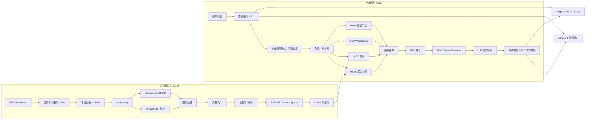

<div align="center">

# Equipment RAG Agent

### 面向制造业设备手册与运维知识的多路检索增强智能问答系统

基于 **LangGraph + MinerU + BGE-M3 + Milvus + Reranker + MCP + Langfuse** 构建，覆盖设备文档导入、结构化解析、混合检索、多轮问答、流式输出、质量追踪与用户反馈闭环。


</div>

---

## 项目简介

Equipment RAG Agent 面向制造业设备知识管理与现场运维场景，目标是将分散的设备说明书、操作手册、SOP、维护记录等文档，转换为可检索、可追踪、可复用的设备知识库。

项目并非简单的“PDF 问答 Demo”，而是拆分为两条独立的 Agent 工作流：

1. **知识库导入 Agent**：负责文件上传、文档解析、图片处理、语义切片、设备名称识别、向量生成和 Milvus 入库。
2. **设备问答 Agent**：负责设备型号确认、多路并发检索、RRF 融合、Reranker 重排、答案生成、SSE 流式返回和问答质量追踪。

典型应用场景：

- 设备工程师查询设备操作方法、参数设置和故障处理步骤；
- 新员工快速检索设备说明书与 SOP；
- 多厂区复用同型号设备的操作经验；
- 从复杂 PDF 中保留图片、表格、公式及其上下文；
- 对模糊型号进行澄清，避免检索到错误设备资料；
- 通过 Langfuse Trace 和用户反馈定位低质量回答。

> 稳定版本以 `main` 分支为准，功能升级通过独立 Pull Request 合入。

---

## 核心能力

| 模块 | 能力 | 状态 |
|---|---|---|
| 文档导入 | PDF、Markdown 文件上传与后台处理 | ✅ 已实现 |
| 文档解析 | 通过独立 MinerU 3.x API 将 PDF 转换为 Markdown 和结构化 JSON | ✅ 已实现 |
| 图片处理 | 识别 Markdown 引用图片并上传 MinIO | ✅ 已实现 |
| 文档切片 | 按标题和正文结构进行设备文档切片 | ✅ 已实现 |
| 设备识别 | 从文件名和正文中识别设备名称、品牌和型号 | ✅ 已实现 |
| 混合向量 | BGE-M3 生成 1024 维 Dense Vector 和 Sparse Vector | ✅ 已实现 |
| 向量存储 | Milvus 自动建表、自动建索引、同设备旧数据幂等清理 | ✅ 已实现 |
| 本地检索 | Milvus Dense + Sparse 混合检索 | ✅ 已实现 |
| HyDE 检索 | 生成假设回答后进行第二路向量检索 | ✅ 已实现 |
| 联网检索 | 通过百炼 MCP WebSearch 获取补充资料 | ✅ 已实现 |
| 图谱检索 | Neo4j 节点已接入 LangGraph，实际查询逻辑待补充 | 🚧 预留节点 |
| 结果融合 | RRF 对多路检索结果进行融合排序 | ✅ 已实现 |
| 精排模型 | BGE / Qwen Reranker Provider 可配置切换 | ✅ 已实现 |
| 多轮对话 | MongoDB 保存会话历史、改写问题和设备名称 | ✅ 已实现 |
| 流式回答 | FastAPI + SSE 增量输出 | ✅ 已实现 |
| 回答图片 | 从本地切片或检索文档中提取图片链接 | ✅ 已实现 |
| 可观测性 | Langfuse Trace、节点耗时、Token、基础评分 | ✅ 已实现 |
| 用户反馈 | 点赞/点踩同时写入 Langfuse 和 MongoDB | ✅ 已实现 |
| 权限与鉴权 | API Key、角色和租户级运行/会话/向量/对象隔离 | ✅ 已实现 |
| 自动化评测 | 确定性离线数据集、阈值门禁和报告 | ✅ 已实现 |

---

## 系统架构



---

## 知识库导入流程

导入 Agent 使用 LangGraph 编排以下节点：

```text
node_entry
    ├── PDF  → node_pdf_to_md
    └── MD   → 直接进入 node_md_img
                    ↓
              node_md_img
                    ↓
          node_document_split
                    ↓
      node_item_name_recognition
                    ↓
          node_bge_embedding
                    ↓
          node_import_milvus
                    ↓
                   END
```

### 处理步骤

1. 上传 PDF 或 Markdown 文件；
2. 文件保存到本地任务目录，并尝试同步到 MinIO；
3. PDF 通过独立 MinerU API 异步解析；
4. 下载并解压 MinerU 返回的 Markdown、图片和结构化 JSON；
5. 提取 Markdown 图片及上下文，生成可访问的图片地址；
6. 按文档标题层级和正文内容切片；
7. 调用 LLM 识别设备名称、品牌和型号；
8. 使用 BGE-M3 生成 Dense 和 Sparse 双向量；
9. 自动创建 Milvus Collection 与索引；
10. 按 `item_name` 删除旧数据后批量写入，实现幂等更新。

### Milvus 索引

| 向量字段 | 类型 | 索引 | 距离度量 |
|---|---|---|---|
| `dense_vector` | FLOAT_VECTOR，默认 1024 维 | HNSW | COSINE |
| `sparse_vector` | SPARSE_FLOAT_VECTOR | SPARSE_INVERTED_INDEX | IP |

---

## 设备问答流程

问答 Agent 使用 LangGraph 编排多路检索：

```text
node_item_name_confirm
          ↓
   node_multi_search
     ├── node_search_embedding
     ├── node_search_embedding_hyde
     ├── node_web_search_mcp
     └── node_query_kg（预留）
          ↓
       node_join
          ↓
       node_rrf
          ↓
      node_rerank
          ↓
  node_answer_output
          ↓
         END
```

### 关键设计

- **设备型号确认**：从问题和历史对话中提取设备名称并改写问题；
- **模糊问题处理**：设备型号不明确时，直接向用户发起澄清，不继续错误检索；
- **本地混合检索**：结合 BGE-M3 Dense 与 Sparse 向量，提高语义和关键词召回；
- **HyDE 检索**：利用假设答案增强复杂问题的召回能力；
- **MCP 联网搜索**：从外部资料补充本地知识库缺失的信息；
- **RRF 融合**：对多路结果统一融合，降低单一检索策略偏差；
- **Reranker 精排**：根据问题与候选文档的相关性重新排序；
- **答案溯源**：向 Prompt 注入来源、标题、Chunk ID、URL 和分数；
- **图片返回**：识别本地 Markdown 图片或联网结果中的图片 URL；
- **多轮记忆**：MongoDB 保存用户问题、回答、设备名称、图片和 Trace ID；
- **质量闭环**：Langfuse 记录完整调用链路，页面支持点赞和点踩。

---

## 技术栈

| 分类 | 技术 |
|---|---|
| Agent 编排 | LangGraph、LangChain |
| Web 服务 | FastAPI、Uvicorn |
| LLM | OpenAI-Compatible API、ChatOpenAI |
| PDF 解析 | MinerU 3.x API |
| Embedding | BGE-M3 |
| 向量数据库 | Milvus |
| 融合排序 | RRF、Milvus WeightedRanker |
| Reranker | BGE Reranker、Qwen3 Reranker |
| 会话存储 | MongoDB |
| 对象存储 | MinIO |
| 联网工具 | MCP、百炼 WebSearch |
| 知识图谱 | Neo4j（节点预留） |
| 可观测性 | Langfuse |
| 前端交互 | HTML、JavaScript、SSE |
| 包管理 | uv |
| 日志 | Loguru |

---

## 项目结构

```text
equipment-rag/
├── app/
│   ├── clients/                         # Milvus、MinIO、MongoDB、Neo4j、MinerU 客户端
│   ├── conf/                            # LLM、Embedding、Milvus、MinerU、Reranker 等配置
│   ├── core/                            # 日志与 Prompt 加载
│   ├── import_process/
│   │   ├── agent/
│   │   │   ├── main_graph.py            # 知识库导入 LangGraph
│   │   │   ├── state.py                 # 导入状态定义
│   │   │   └── nodes/                   # PDF解析、图片、切片、Embedding、入库节点
│   │   ├── api/file_import_service.py   # 文件导入 FastAPI 服务
│   │   └── page/import.html             # 文件导入页面
│   ├── lm/                              # LLM、Embedding、旧版 Reranker 工具
│   ├── model/reranker/                  # BGE / Qwen Reranker Provider
│   ├── observability/                   # Langfuse 监控与 RAG 自动评分
│   ├── query_process/
│   │   ├── agent/
│   │   │   ├── main_graph.py            # 设备问答 LangGraph
│   │   │   ├── state.py                 # 查询状态定义
│   │   │   └── nodes/                   # 检索、RRF、Rerank、回答节点
│   │   ├── api/query_service.py         # 查询 FastAPI 服务
│   │   └── page/chat.html               # 问答页面
│   ├── tool/                            # 模型下载脚本
│   └── utils/                           # SSE、任务状态、路径和格式工具
├── deploy/
│   └── langfuse/docker-compose.yml      # Langfuse 本地部署
├── prompts/                             # Prompt 模板
├── test/                                # 节点与全流程测试
├── pyproject.toml                       # 主项目依赖
└── uv.lock                              # uv 锁定依赖
```

---

## 环境要求

### 基础环境

- Python `>=3.12,<3.13`
- uv
- Docker / Docker Compose
- Windows、Linux 或 WSL2
- NVIDIA GPU 可选，但处理 PDF、Embedding 和 Reranker 时建议使用

### 外部服务

| 服务 | 是否必需 | 用途 |
|---|---|---|
| LLM API | 必需 | 设备识别、问题改写、HyDE、答案生成 |
| Milvus | 必需 | Dense + Sparse 混合向量存储与检索 |
| MongoDB | 查询服务建议启用 | 多轮会话、Trace ID、反馈状态 |
| MinIO | 导入服务建议启用 | 原始文件和图片存储 |
| MinerU API | 导入 PDF 时必需 | PDF 转 Markdown 和结构化内容 |
| Langfuse | 可选 | Agent 链路、Token、评分与反馈 |
| 百炼 MCP | 可选 | 联网 WebSearch |
| Neo4j | 暂不必需 | 当前图谱节点仍为预留实现 |

---

## 快速开始

### Docker 一条命令启动（推荐）

```bash
git clone https://github.com/Markhhyu/equipment-rag.git
cd equipment-rag
docker compose up --build
```

该命令会同时启动查询 API、导入 API、MongoDB、MinIO、etcd 和 Milvus，无需先创建 `.env`。首次启动需要下载 Python 依赖和 BGE 模型，请耐心等待。

启动后可访问：

- 聊天页面：`http://localhost:8001/chat.html`
- 导入页面：`http://localhost:8000/import.html`
- 查询 API 文档：`http://localhost:8001/docs`
- 导入 API 文档：`http://localhost:8000/docs`
- MinIO 控制台：`http://localhost:9001`

要真正调用 LLM，请复制配置模板并填写自己的 OpenAI-Compatible API：

```bash
cp .env.example .env
docker compose up --build
```

Windows PowerShell：

```powershell
Copy-Item .env.example .env
docker compose up --build
```

> Markdown 文件导入无需 MinerU；PDF 解析需要另行启动 MinerU，默认地址为宿主机 `8002` 端口。Langfuse、Neo4j 和 MCP WebSearch 也是可选集成。

本地默认无需 API Key，并只绑定 `127.0.0.1`。生产部署会在未启用认证时拒绝启动；API Key、角色、租户隔离和私有 MinIO 配置见 [`docs/security.md`](docs/security.md)。

### 本地 Python 开发

项目使用 Python 3.14 和 uv。依赖版本已写入 `uv.lock`：

```bash
uv sync --frozen
uv run uvicorn app.import_process.api.file_import_service:app --host 127.0.0.1 --port 8000
uv run uvicorn app.query_process.api.query_service:app --host 127.0.0.1 --port 8001
```

开发者安装质量工具并执行与 CI 相同的本地检查：

```bash
uv sync --frozen --group dev
uv run python scripts/check.py
```

离线评测与真实 API 回归使用同一个评测入口，详见 `evals/README.md`：

```bash
uv run python -m app.evaluation.cli replay \
  --predictions evals/fixtures/smoke_predictions.jsonl \
  --fail-on-threshold
```

### 运行恢复

Docker Compose 默认把运行状态和 LangGraph checkpoint 保存到 MongoDB。进程异常退出后，可使用原 `trace_id` 或 `task_id` 查看并恢复运行：

```text
GET  /runs/{run_id}
POST /runs/{run_id}/retry
```

恢复会从最后成功的 LangGraph 节点继续，并受租约和最大尝试次数保护。完整说明见 `docs/durable-runtime.md`。

### 环境变量

完整模板见 `.env.example`。以下是主要配置：

```env
# =========================================================
# LLM
# =========================================================
OPENAI_BASE_URL=https://your-openai-compatible-endpoint/v1
OPENAI_API_KEY=replace-with-your-api-key
LLM_DEFAULT_MODEL=your-chat-model
VL_MODEL=your-vision-model
LLM_DEFAULT_TEMPERATURE=0.1

# =========================================================
# BGE-M3 Embedding
# =========================================================
BGE_M3=BAAI/bge-m3
BGE_M3_PATH=/absolute/path/to/bge-m3
BGE_DEVICE=cpu
BGE_FP16=false

# =========================================================
# Reranker
# provider支持：bge、qwen
# =========================================================
RERANKER_PROVIDER=bge
RERANKER_MODEL=BAAI/bge-reranker-v2-m3
RERANKER_DEVICE=cpu
RERANKER_USE_FP16=false
RERANKER_BATCH_SIZE=8
RERANKER_MAX_LENGTH=512
RERANKER_NORMALIZE_SCORE=false

# 旧配置名仍保留兼容，可不配置
BGE_RERANKER_LARGE=BAAI/bge-reranker-v2-m3
BGE_RERANKER_DEVICE=cuda:0
BGE_RERANKER_FP16=true

# =========================================================
# Milvus
# =========================================================
MILVUS_URL=http://127.0.0.1:19530
CHUNKS_COLLECTION=equipment_chunks
ENTITY_NAME_COLLECTION=equipment_entities
ITEM_NAME_COLLECTION=equipment_item_names

# =========================================================
# MongoDB
# =========================================================
MONGO_URL=mongodb://127.0.0.1:27017
MONGO_DB_NAME=equipment_rag

# =========================================================
# MinIO
# MINIO_ENDPOINT通常填写host:port，不包含http://
# =========================================================
MINIO_ENDPOINT=127.0.0.1:9000
MINIO_PUBLIC_ENDPOINT=localhost:9000
MINIO_ACCESS_KEY=minioadmin
MINIO_SECRET_KEY=minioadmin
MINIO_BUCKET_NAME=equipment-rag
MINIO_IMG_DIR=images
MINIO_PDF_DIR=pdf_files
MINIO_SECURE=False

# =========================================================
# MinerU API
# =========================================================
MINERU_API_BASE_URL=http://127.0.0.1:8002
MINERU_API_TOKEN=
MINERU_BACKEND=hybrid-engine
MINERU_EFFORT=high
MINERU_PARSE_METHOD=auto
MINERU_LANGUAGE=ch_server
MINERU_FORMULA_ENABLE=true
MINERU_TABLE_ENABLE=true
MINERU_IMAGE_ANALYSIS=true
MINERU_RETURN_MIDDLE_JSON=true
MINERU_RETURN_CONTENT_LIST=true
MINERU_POLL_INTERVAL_SECONDS=3
MINERU_TASK_TIMEOUT_SECONDS=3600
MINERU_REQUEST_TIMEOUT_SECONDS=60
MINERU_DOWNLOAD_TIMEOUT_SECONDS=600
MINERU_VERIFY_SSL=true

# 没有可用CUDA时建议改为：
# MINERU_BACKEND=pipeline
# MINERU_IMAGE_ANALYSIS=false

# =========================================================
# MCP WebSearch
# 当前MCP鉴权复用OPENAI_API_KEY
# =========================================================
MCP_DASHSCOPE_BASE_URL=https://your-mcp-sse-endpoint

# =========================================================
# Langfuse
# =========================================================
LANGFUSE_TRACING_ENABLED=true
LANGFUSE_HOST=http://127.0.0.1:3000
LANGFUSE_PUBLIC_KEY=replace-with-public-key
LANGFUSE_SECRET_KEY=replace-with-secret-key

# =========================================================
# Neo4j（当前仅预留）
# =========================================================
NEO4J_URI=bolt://127.0.0.1:7687
NEO4J_USERNAME=neo4j
NEO4J_PASSWORD=replace-with-password
```

> 不要将真实 API Key、密码、`.env` 或模型访问凭证提交到 Git。

---

## MinerU 独立服务

MinerU 依赖较重，建议使用独立虚拟环境运行，不安装到主项目 `.venv`。

### Windows PowerShell

```powershell
cd deploy
New-Item -ItemType Directory -Force mineru-runtime | Out-Null
cd mineru-runtime

uv venv --python 3.12
.\.venv\Scripts\Activate.ps1

uv pip install -U "mineru[all]==3.4.4"
```

启动服务：

```powershell
$env:MINERU_MODEL_SOURCE="modelscope"
$env:MINERU_API_OUTPUT_ROOT="$PWD\output"
$env:MINERU_API_MAX_CONCURRENT_REQUESTS="1"
$env:CUDA_VISIBLE_DEVICES="0"

mineru-api --host 127.0.0.1 --port 8002 --enable-vlm-preload false
```

健康检查：

```powershell
Invoke-RestMethod http://127.0.0.1:8002/health
```

### CPU 模式

主项目 `.env`：

```env
MINERU_BACKEND=pipeline
MINERU_IMAGE_ANALYSIS=false
```

### GPU 模式

主项目 `.env`：

```env
MINERU_BACKEND=hybrid-engine
MINERU_EFFORT=high
MINERU_IMAGE_ANALYSIS=true
```

验证 MinerU 环境是否识别 GPU：

```powershell
python -c "import torch; print('torch=', torch.__version__); print('torch_cuda=', torch.version.cuda); print('cuda_available=', torch.cuda.is_available()); print('gpu=', torch.cuda.get_device_name(0) if torch.cuda.is_available() else 'NONE')"
```

---

## 启动 Langfuse

```bash
cd deploy/langfuse
docker compose up -d
```

启动后根据实际 Compose 配置访问 Langfuse，并创建项目获取：

```env
LANGFUSE_PUBLIC_KEY=...
LANGFUSE_SECRET_KEY=...
LANGFUSE_HOST=...
```

关闭：

```bash
docker compose down
```

---

## 启动服务

### 1. 文件导入服务

```bash
uv run python -m app.import_process.api.file_import_service
```

默认地址：

- 导入页面：`http://127.0.0.1:8000/import.html`
- Swagger：`http://127.0.0.1:8000/docs`
- 上传接口：`POST http://127.0.0.1:8000/upload`
- 任务状态：`GET http://127.0.0.1:8000/status/{task_id}`
- 持久化运行：`GET http://127.0.0.1:8000/runs/{task_id}`
- 失败恢复：`POST http://127.0.0.1:8000/runs/{task_id}/retry`

### 2. 查询服务

```bash
uv run python -m app.query_process.api.query_service
```

默认地址：

- 聊天页面：`http://127.0.0.1:8001/chat.html`
- Swagger：`http://127.0.0.1:8001/docs`
- 健康检查：`GET http://127.0.0.1:8001/health`
- 问答接口：`POST http://127.0.0.1:8001/query`
- 持久化运行：`GET http://127.0.0.1:8001/runs/{trace_id}`
- 失败恢复：`POST http://127.0.0.1:8001/runs/{trace_id}/retry`
- SSE：`GET http://127.0.0.1:8001/stream/{session_id}`
- 会话历史：`GET http://127.0.0.1:8001/history/{session_id}`
- 清空历史：`DELETE http://127.0.0.1:8001/history/{session_id}`
- 用户反馈：`POST http://127.0.0.1:8001/feedback`

---

## API 示例

### 上传文档

```bash
curl -X POST "http://127.0.0.1:8000/upload" \
  -F "files=@./doc/equipment-manual.pdf"
```

返回示例：

```json
{
  "code": 200,
  "message": "Files uploaded successfully, total: 1",
  "task_ids": [
    "65b6804e-a85b-4b9e-9a86-fc9ac455a888"
  ]
}
```

查询任务状态：

```bash
curl "http://127.0.0.1:8000/status/65b6804e-a85b-4b9e-9a86-fc9ac455a888"
```

### 非流式问答

```bash
curl -X POST "http://127.0.0.1:8001/query" \
  -H "Content-Type: application/json" \
  -d '{
    "query": "HAK180烫金机如何设置局部转印区域？",
    "session_id": "demo-session-001",
    "is_stream": false
  }'
```

### 流式问答

先提交问题：

```bash
curl -X POST "http://127.0.0.1:8001/query" \
  -H "Content-Type: application/json" \
  -d '{
    "query": "设备启动前需要检查哪些项目？",
    "session_id": "demo-session-002",
    "is_stream": true
  }'
```

再订阅 SSE：

```bash
curl -N "http://127.0.0.1:8001/stream/demo-session-002"
```

### 查询历史

```bash
curl "http://127.0.0.1:8001/history/demo-session-001?limit=50"
```

### 提交回答反馈

```bash
curl -X POST "http://127.0.0.1:8001/feedback" \
  -H "Content-Type: application/json" \
  -d '{
    "trace_id": "32位LangfuseTraceID",
    "value": 1,
    "comment": "回答准确，步骤清晰"
  }'
```

`value` 说明：

- `1`：点赞；
- `0`：点踩。

---

## 测试

### 知识库导入全流程

```bash
uv run python test/04-test_graph_flow.py
```

### Langfuse 连接

```bash
uv run python test/06-test_langfuse_connection.py
```

### Reranker Provider

```bash
uv run python test/07-test_reranker_provider.py
```

### BGE-M3

```bash
uv run python test/test_bge_m3.py
```

### MinerU 客户端

```bash
uv run python -m app.import_process.agent.nodes.node_pdf_to_md
```

---

## Langfuse 可观测性

每轮问答使用两个标识：

- `session_id`：一段多轮会话；
- `trace_id`：当前单轮问答。

当前 Trace 可覆盖：

- LangGraph 完整工作流；
- 节点执行链路与耗时；
- BGE-M3 向量生成；
- Milvus 检索；
- RRF 和 Reranker；
- LLM 请求、响应与 Token；
- 最终回答；
- 自动基础评分；
- 用户点赞或点踩。

问答结束后，`trace_id` 同时返回给前端并写入 MongoDB，便于从页面反馈追溯到 Langfuse 中的具体调用链路。

---

## Reranker 切换

### BGE Reranker

```env
RERANKER_PROVIDER=bge
RERANKER_MODEL=BAAI/bge-reranker-v2-m3
RERANKER_DEVICE=cuda:0
RERANKER_USE_FP16=true
```

### Qwen3 Reranker

```env
RERANKER_PROVIDER=qwen
RERANKER_MODEL=Qwen/Qwen3-Reranker-0.6B
RERANKER_DEVICE=cuda:0
RERANKER_USE_FP16=true
```

Provider 使用单例缓存，同一进程中不会为每次请求重复加载模型。

---

## 常见问题

### 1. MinerU 报错 `Can not find $env:CUDA_PATH`

说明系统能够识别显卡，但没有完整安装 CUDA Toolkit，或当前终端没有读取到环境变量。

```powershell
$env:CUDA_PATH="C:\Program Files\NVIDIA GPU Computing Toolkit\CUDA\v12.6"
$env:CUDA_HOME=$env:CUDA_PATH
$env:Path="$env:CUDA_PATH\bin;$env:Path"

nvcc --version
```

### 2. `torch.cuda.is_available()` 返回 `False`

先检查是否误装 CPU 版 PyTorch：

```powershell
python -c "import torch; print(torch.__version__); print(torch.version.cuda); print(torch.cuda.is_available())"
```

版本包含 `+cpu` 时，需要根据本机 CUDA 和 PyTorch 版本重新安装对应 CUDA Wheel。

### 3. MinerU 返回 `Language auto not supported`

当前语言参数不能配置为 `auto`，使用：

```env
MINERU_LANGUAGE=ch_server
```

`MINERU_PARSE_METHOD=auto` 可以继续保留。

### 4. MinerU 択错 `PageChars object is not iterable`

升级到已兼容新版 `pdftext` 的 MinerU：

```powershell
uv pip install --upgrade "mineru[all]==3.4.4"
```

升级后再次检查 PyTorch 是否被依赖解析器替换为 CPU 版本。

### 5. Milvus 入库缺少 `dense_vector`

说明 BGE-M3 节点未成功生成向量，重点检查：

- `BGE_M3_PATH`；
- `BGE_DEVICE`；
- 模型是否完整下载；
- GPU 显存是否充足；
- `torch.cuda.is_available()`；
- 日志中的 `node_bge_embedding` 异常。

### 6. 查询服务启动时 MongoDB 报错

检查：

```env
MONGO_URL=mongodb://127.0.0.1:27017
MONGO_DB_NAME=equipment_rag
```

并确认 MongoDB 端口可访问。

### 7. MCP 搜索结果为空

检查：

- `MCP_DASHSCOPE_BASE_URL`；
- `OPENAI_API_KEY`；
- MCP SSE 地址是否可访问；
- 服务端工具名称是否为 `bailian_web_search`。

---

## 当前限制

1. **Neo4j 查询仍为预留节点**：当前 `node_query_kg` 尚未实现实际图谱查询和结果返回；
2. **SSE 连接和节点展示进度仍为进程内数据**：运行注册表与 checkpoint 已持久化，但自动分布式队列调度尚未接入；
3. **本地模式不构成生产认证边界**：本地默认免 API Key，生产模式会强制 API Key；
4. **当前授权粒度为租户与角色**：尚未细化到单台设备、文档和字段级 ABAC；
5. **历史数据需要迁移**：启用生产多租户前，需要为旧 MongoDB/Milvus 数据分配租户或重新导入；
6. **联网结果与本地 SOP 的可信级别尚未强制分层**；
7. **当前评测集为合成冒烟基线**：上线前仍需使用经过脱敏和授权的企业设备数据扩充；
8. **当前认证面向服务调用方**：企业终端用户 SSO/OIDC、用户生命周期和细粒度审计仍需接入统一身份平台；
9. **本项目用于知识检索和辅助判断，不应直接替代设备安全规范、锁机挂牌流程或专业工程师确认。**

---

## Roadmap

- [ ] 完成 Neo4j 设备实体关系检索；
- [ ] 增加厂区、设备型号、软件版本、PLC 版本等元数据过滤；
- [ ] 增加本地 SOP 优先级和联网资料可信等级；
- [ ] 增加严格拒答与人工审核闭环；
- [x] 接入 API Key、角色和租户级数据隔离；
- [ ] 接入企业 OIDC/SSO 与用户生命周期管理；
- [ ] 增加设备、文档和字段级 ABAC 策略；
- [x] 增加 MongoDB 运行注册表、LangGraph checkpoint 和失败恢复；
- [x] 建立确定性评测数据集和自动回归门禁；
- [ ] 增加设备告警分析 Agent；
- [ ] 增加 OEE 分析 Agent 与 ECharts 展示；
- [x] 增加 Docker Compose 一键启动方案；
- [x] 建立单元测试、覆盖率和 CI 质量门禁；

---

## 开发规范

- 新增 Agent 节点时同步更新对应的 `State`；
- 节点必须记录开始、完成和异常日志；
- 配置统一从 `.env` 读取，不在代码中提交密码和 Token；
- 模型实例使用单例缓存，避免重复加载；
- 写入 Milvus 前必须校验向量字段；
- 外部工具异常应降级为空结果，不阻断核心本地检索；
- Prompt 修改后应执行固定问题集回归测试；
- 生产环境必须启用认证、限制 CORS，并保持 MinIO 私有读取。

---

## Git 分支建议

```text
main        稳定版本
feature/*   独立功能分支
fix/*       问题修复分支
```

推荐所有升级通过 Pull Request 合并到 `main`，合并前至少执行：

```bash
uv sync --frozen
docker compose config --quiet
uv pip check
uv run python -m compileall -q app
```

---

## License

当前仓库尚未提供 `LICENSE` 文件。在正式开放复用或接受外部贡献前，建议补充明确的开源许可证。

---

## 作者

GitHub：[@Markhhyu](https://github.com/Markhhyu)
